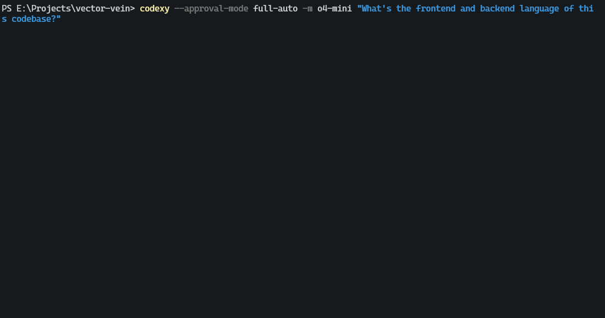

<h1 align="center">OpenAI Codex CLI (Python 实现)</h1>
<p align="center">一个在终端中运行的轻量级编码助手（Python 版本）</p>

<p align="center"><code>pip install -U codexy</code></p>



---

<details>
<summary><strong>目录</strong></summary>

- [原始 TypeScript 版本](#原始-typescript-版本)
- [实验性技术免责声明](#实验性技术免責声明)
- [快速开始](#快速开始)
- [为何选择 Codexy?](#为何选择-codexy)
- [安全模型与权限](#安全模型与权限)
- [系统要求](#系统要求)
- [CLI 参考](#cli-参考)
- [配置](#配置)
- [项目文档 (Project Docs)](#项目文档-project-docs)
- [贡献](#贡献)
- [许可证](#许可证)
- [零数据保留 (ZDR) 组织限制](#零数据保留-zdr-组织限制)

</details>

---

## 原始 TypeScript 版本

本项目是原始 OpenAI Codex CLI 的 Python 重新实现，原版使用 TypeScript 编写。您可以在这里找到原始仓库：

[openai/codex (TypeScript)](https://github.com/openai/codex)

这个 Python 版本旨在利用 Python 工具和库提供类似的功能。

## 实验性技术免責声明

Codexy (Codex CLI 的 Python 实现) 是一个正在积极开发中的实验性项目。它尚未稳定，可能包含错误、未完成的功能，或可能发生破坏性更改。我们正在与社区一起公开构建它，并欢迎：

-   错误报告
-   功能请求
-   拉取请求 (Pull Requests)
-   积极的反馈

请通过提交 Issues 或 PRs 帮助我们改进（参见贡献部分）！

## 快速开始

使用 pip 全局安装：

```shell
pip install -U codexy
```

接下来，设置您的 OpenAI API 密钥作为环境变量：

```shell
export OPENAI_API_KEY="你的-API-密钥"
```

> **注意:** 此命令仅为当前终端会话设置密钥。要使其永久生效，请将 `export` 行添加到您的 shell 配置文件中（例如 `~/.zshrc`、`~/.bashrc`）。
>
> **提示:** 您也可以将 API 密钥放在项目根目录下的 `.env` 文件中：
>
> ```env
> OPENAI_API_KEY=你的-API-密钥
> ```
>
> CLI 将使用 `python-dotenv` 自动加载 `.env` 文件中的变量。

以交互模式运行：

```shell
codexy
```

或者，将提示作为输入运行（并可选择 `Full Auto` 模式）：

```shell
codexy "请解释一下这个代码库"
```

```shell
# 请谨慎使用自动批准模式
codexy --approval-mode full-auto "创建一个最炫酷的待办事项列表应用"
```

就是这样 – Codexy 将与 OpenAI API 交互，建议文件更改或命令，并（根据您的批准模式）执行它们。

---

## 为何选择 Codexy?

Codexy 旨在将原始 Codex CLI 的强大功能带入 Python 生态系统。它专为偏好 Python 工具或希望将智能编码代理能力集成到 Python 工作流中的开发人员而构建。

-   **熟悉的 Python 技术栈:** 使用常见的 Python 库，如 `click`、`textual`、`openai`、`httpx`。
-   **终端原生:** 为习惯在终端中工作的开发人员设计。
-   **智能代理能力:** 理解提示，与代码交互，建议文件编辑，并能执行命令。
-   **可配置的批准:** 控制代理拥有的自主权级别。
-   **开源:** 贡献其发展并了解其工作原理。

---

## 安全模型与权限

Codexy 允许您通过 `--approval-mode` 标志（或配置文件）决定代理的自主程度。这些模式决定了哪些操作需要您的明确确认：

| 模式                      | 代理无需询问即可执行的操作                           | 仍需批准的操作                            | 备注                                                                     |
| ------------------------- | ------------------------------------------------------ | ------------------------------------------- | ------------------------------------------------------------------------ |
| **Suggest** <br>(默认)   | • 读取文件<br>• 运行已知的安全只读命令¹           | • **所有** 文件编辑/写入<br>• Shell 命令   | 最安全的模式，大多数操作都需要确认。                                         |
| **Auto Edit**             | • 读取文件<br>• 应用文件编辑/写入<br>• 安全的只读操作¹ | • Shell 命令                                | 自动修改文件，但在运行命令前会询问。                                       |
| **Full Auto**             | • 读/写文件<br>• 运行 Shell 命令²<br>• 安全的只读操作¹    | –                                           | 尝试自动批准，**但沙盒功能尚未实现**。                                      |
| **Dangerous Auto**        | • 读/写文件<br>• 运行 Shell 命令                      | –                                           | **不安全**。无需沙盒自动批准所有操作。请极其谨慎使用。                         |

¹ *已知的安全只读命令包括 `ls`、`cat`、`pwd`、`git status` 等。可通过配置文件中的 `safe_commands` 进行用户配置。*
² *虽然 `full-auto` 旨在实现沙盒执行，但此 Python 版本**尚未实现沙盒功能**。命令将直接运行。*

**⚠️ 重要提示:** Python 版本 (`codexy`) 目前**缺少**原始 TypeScript 版本中的平台特定沙盒机制（如 macOS Seatbelt 或 Docker/iptables）。在 `full-auto` 模式下，命令会在您的系统上直接执行，工具本身不会施加网络或文件系统限制。`dangerous-auto` 模式明确地在非沙盒环境中运行所有操作。请极其谨慎地使用自动批准模式，尤其是在不受信任的环境或未受版本控制的仓库中。

如果您在 `auto-edit`、`full-auto` 或 `dangerous-auto` 模式下启动，并且当前目录未被 Git 跟踪，Codexy 会显示警告/确认信息，以便您通过版本控制获得安全保障。

---

## 系统要求

| 要求         | 详情                                       |
| ------------ | ------------------------------------------ |
| 操作系统     | Linux, macOS, Windows (跨平台)             |
| Python       | **3.10 或更高版本** (见 `pyproject.toml`) |
| Pip          | 用于安装                                   |
| Git (可选)   | 推荐用于安全保障                           |
| 依赖项       | `click`, `textual`, `openai` 等            |

---

## CLI 参考

```
用法: codexy [OPTIONS] [PROMPT]

  Codex 代理的交互式 REPL。

  codexy         交互式 REPL
  codexy "..."   交互式 REPL 的初始提示

选项:
  --model, -m TEXT              要使用的模型 (例如, o4-mini)。
  --image, -i PATH              要包含作为输入的图像文件的路径。 (未完全实现)
  --view, -v PATH               检查先前保存的 rollout 而不是开始会话。 (未实现)
  --quiet, -q                   非交互模式，仅打印助手最终输出。(未实现)
  --config, -c                  在编辑器中打开指令文件。
  --writable-root, -w PATH      full-auto 模式下的可写文件夹 (未来用于沙盒)。
  --approval-mode, -a [suggest|auto-edit|full-auto|dangerous-auto]
                                覆盖批准策略。
  --auto-edit                   --approval-mode=auto-edit 的别名。
  --full-auto                   --approval-mode=full-auto 的别名。
  --no-project-doc              不自动包含仓库的 codex.md。
  --project-doc PATH            包含一个额外的 markdown 文件作为上下文。
  --full-stdout                 不截断命令的 stdout/stderr 输出。
  --notify                      启用桌面通知。(未实现)
  --flex-mode                   启用 "flex-mode" 服务层级。(未实现)
  --dangerously-auto-approve-everything
                                --approval-mode=dangerous-auto 的别名。
  --full-context, -f            以 "full-context" 模式启动。(未实现)
  --version                     显示版本信息并退出。
  -h, --help                    显示此帮助消息并退出。

命令:
  completion                    生成 shell 自动补全脚本。
```

**应用内命令 (TUI 中):**

| 命令            | 描述                                    |
| --------------- | --------------------------------------- |
| `/help`         | 显示命令和快捷键帮助                    |
| `/model`        | 切换 LLM 模型 (若在首次响应前)         |
| `/approval`     | 切换自动批准模式                        |
| `/history`      | 显示当前会话的命令历史                  |
| `/clear`        | 清除屏幕和当前对话上下文                |
| `/clearhistory` | 清除磁盘上的命令历史文件                |
| `/bug`          | 在浏览器中打开预填信息的 Bug 报告 (未实现) |
| `/compact`      | 将上下文压缩成摘要 (未实现)             |
| `q` / `exit`    | 退出应用                                |

---

## 配置

Codexy 在 `~/.codexy/` 目录中查找配置文件 (注意目录名是 `codexy`)。

-   **`~/.codexy/config.yaml`** (或 `.yml`, `.json`): 主要配置文件。
-   **`~/.codexy/instructions.md`**: 全局自定义指令文件。
-   **`~/.codexy/history.json`**: 存储命令历史。

**`config.yaml` 示例:**

```yaml
# ~/.codexy/config.yaml
model: o4-mini # 默认使用的模型
approval_mode: suggest # suggest | auto-edit | full-auto | dangerous-auto
full_auto_error_mode: ask-user # ask-user | ignore-and-continue
notify: false # 启用桌面通知 (未完全实现)
history:
  max_size: 1000
  save_history: true
safe_commands: # 在 'suggest' 模式下可安全自动批准的命令
  - git status
  - ls -la
```

**`instructions.md` 示例:**

```markdown
- Python 变量始终使用 snake_case。
- 为所有函数定义添加类型提示。
- 优先使用 f-string 进行格式化。
```

---

## 项目文档 (Project Docs)

与原始 Codex CLI 类似，Codexy 可以从 `codex.md` (或 `.codex.md`, `CODEX.md`) 文件加载项目特定的上下文。

它首先搜索当前目录，然后向上遍历直到找到 Git 根目录 (`.git` 目录)。如果找到该文件，其内容将附加到您的全局 `instructions.md` 文件之后。

使用 `--no-project-doc` 或设置环境变量 `CODEXY_DISABLE_PROJECT_DOC=1` 可禁用此行为。

---

## 贡献

欢迎贡献！请参考主项目的 [CONTRIBUTING 指南](https://github.com/openai/codex/blob/main/README.md#contributing)。

针对 Python 开发：

-   本项目使用 [PDM](https://pdm-project.org/) 进行依赖管理。
-   安装依赖: `pdm install -G:dev`
-   运行测试: `pdm run pytest`
-   格式化代码: `pdm run ruff format .`
-   代码检查: `pdm run ruff check .`

---

## 许可证

本项目使用 Apache-2.0 许可证。请参阅 [LICENSE](./LICENSE) 文件。

---

## 零数据保留 (ZDR) 组织限制

> **注意:** Codexy (Python) 目前继承了与原始 Codex CLI 相同的限制，并且**不支持**启用了[零数据保留 (ZDR)](https://platform.openai.com/docs/guides/your-data#zero-data-retention) 的 OpenAI 组织，因为它依赖于与 ZDR 不兼容的 API 功能。如果您的组织使用 ZDR，您可能会遇到 400 错误。